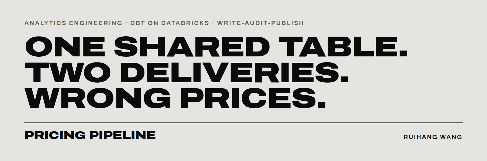
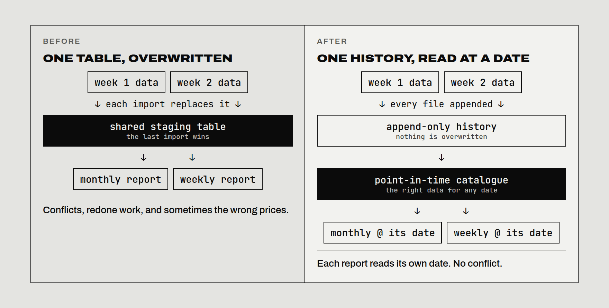
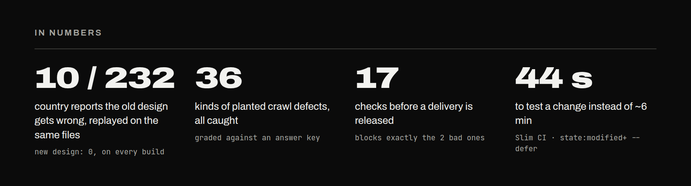
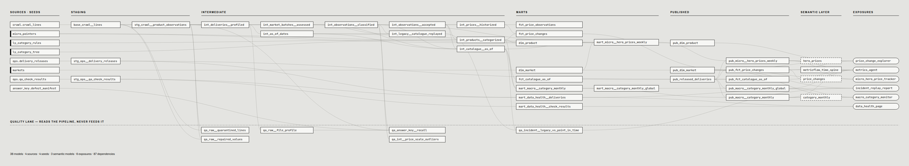
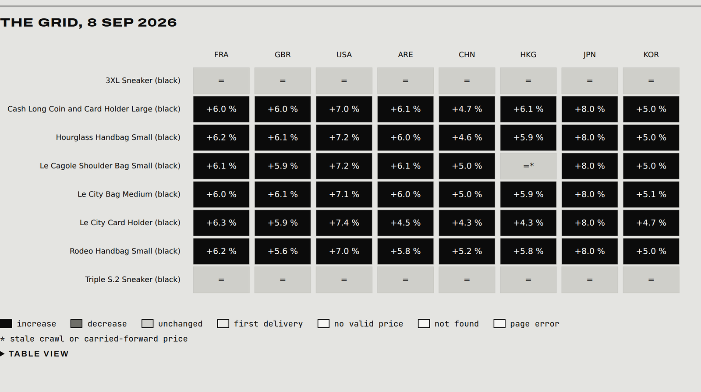
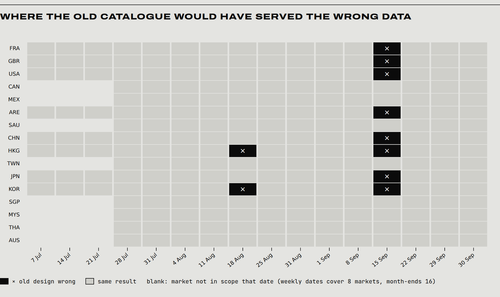
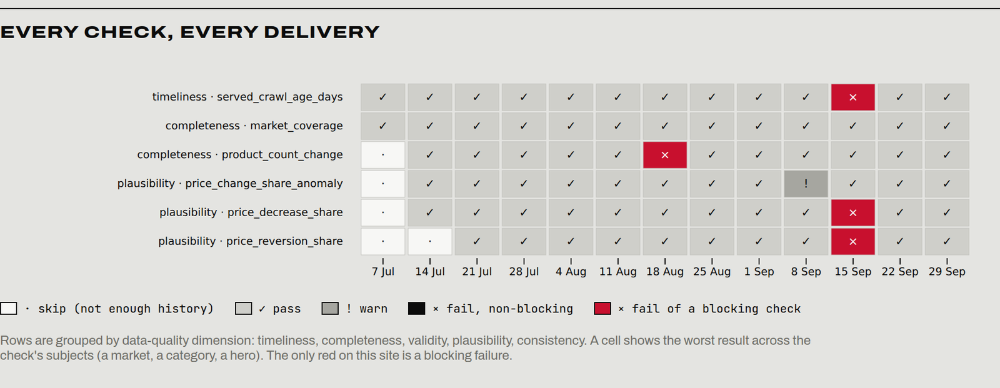

**[SITE](https://calvinwang-3333.github.io/balenciaga-pricing-pipeline/)** &nbsp;·&nbsp;
**[BI PAGES](https://calvinwang-3333.github.io/balenciaga-pricing-pipeline/bi/)** &nbsp;·&nbsp;
**[DBT DOCS](https://calvinwang-3333.github.io/balenciaga-pricing-pipeline/dbt-docs/)** &nbsp;·&nbsp;
**[BUILD LOG](docs/)**

A luxury price-monitoring pipeline, rebuilt with **dbt on Databricks** so that the order in which files are
imported can never change the prices a client receives. Built end to end: synthetic data, models, QA, a delivery
gate, CI/CD, BI pages and a site published by the pipeline itself.

<br>

## THE PROBLEM

Two analysts share one staging table. One builds a **monthly** report from the first week's data, the other a
**weekly** report from the second week's. Every import replaces the whole table, so the weekly update can overwrite
data the monthly report still needs. Nobody does anything wrong: the setup creates the conflict.



## THE FIX

| PRINCIPLE | IN PRACTICE |
|---|---|
| **APPEND, NEVER OVERWRITE** | every delivered line lands once in an append-only bronze table, with its file and load metadata |
| **ONE HISTORY, READ AT A DATE** | an SCD2 price history and a point-in-time catalogue: the latest valid crawl for any market on any date |
| **TWO READS OF ONE HISTORY** | Micro asks for each Tuesday, Macro for each month-end; same rule, same data, no disagreement |
| **WRITE · AUDIT · PUBLISH** | dbt builds, a Python gate audits every delivery, and only released deliveries reach BI |



## LINEAGE

58 nodes, generated from dbt's manifest on every deploy. Nothing is drawn by hand.

<a href="docs/assets/readme/lineage.png"></a>

<sub>LEFT TO RIGHT: SOURCES + SEEDS · STAGING · INTERMEDIATE · MARTS · PUBLISHED · SEMANTIC LAYER · EXPOSURES. BOTTOM BAND: THE QUALITY LANE. CLICK TO ENLARGE.</sub>

## ARCHITECTURE

| LAYER | MODELS | ROLE |
|---|---|---|
| **RAW** | `crawl.crawl_lines` | 238,707 delivered lines, loaded with `COPY INTO`, `delta.appendOnly` |
| **STAGING** | `base_crawl__lines` → `stg_crawl__product_observations` | parse, repair, flag; never filter |
| **INTERMEDIATE** | `int_observations__accepted` · `int_prices__historized` · `int_catalogue__as_of` | one fate per line, SCD2 prices, the point-in-time catalogue |
| **MARTS** | `dim_*` · `fct_*` · `mart_micro__hero_prices_weekly` · `mart_macro__category_monthly` | star schema plus one mart per deliverable, enforced contracts |
| **PUBLISHED** | `pub_*` | public interface: released deliveries only |
| **SEMANTIC** | 3 semantic models · 12 metrics | MetricFlow definitions read by an LLM metrics agent |
| **QUALITY** | `qa_raw__*` · `qa_incident__legacy_vs_point_in_time` | quarantine, answer-key grading, the replay of the old design |

## QUALITY

| WHERE | HOW | RESULT |
|---|---|---|
| **RAW** | quarantine lines that cannot be trusted, keep the raw value | 36 planted defect types, 100 % caught against the answer key |
| **MODELS** | 142 data tests, 4 unit tests, 19 enforced contracts | keys, grains and types guaranteed on every build |
| **THE FIX ITSELF** | one generic test, `serves_latest_eligible_crawl`, on both designs | old design 10 / 232 wrong, new design 0; inverted thresholds keep the evidence alive |
| **RELEASE** | delivery gate: 17 checks as code, append-only audit tables | blocks exactly the 2 faulty deliveries, nothing else |
| **PROJECT** | dbt-project-evaluator at error severity | 77 / 77 rules |

## BI

Six static pages built with Observable Framework on a snapshot of the public models. Every number is computed in
dbt; the pages only filter and draw. Each page ends with a model card: question, grain, models, guarantees.



<sub>MICRO · 8 SEP · THE SEPTEMBER INCREASE, CELL BY CELL</sub>



<sub>THE INCIDENT · WHERE THE OLD DESIGN WOULD HAVE SERVED THE WRONG DATA</sub>



<sub>DATA HEALTH · EVERY CHECK, EVERY DELIVERY · RED ONLY FOR A BLOCKING FAILURE</sub>

## PRODUCTION

| EVENT | WHAT RUNS |
|---|---|
| **PULL REQUEST** | ruff, pytest, `dbt parse` · Slim CI on Databricks (`state:modified+ --defer`) in throw-away schemas · dbt-project-evaluator · BI and site build |
| **MERGE TO MAIN** | `dbt build` in production → delivery gate → `dbt docs generate --static` → lineage from this manifest → BI pages + site + dbt docs on GitHub Pages |
| **PR CLOSED** | drop the PR's CI schemas |

## PHASES

| | CHAPTER | THE QUESTION | |
|---|---|---|---|
| **0** | Environment | Where does everything run, and who can touch what? | [site](https://calvinwang-3333.github.io/balenciaga-pricing-pipeline/phase-0) · [log](docs/01_environment_setup.md) |
| **1** | Synthetic data + bronze | What data, and how does it land without being touched? | [site](https://calvinwang-3333.github.io/balenciaga-pricing-pipeline/phase-1) · [log](docs/02_synthetic_data.md) |
| **2** | Staging and raw QA | Which raw lines can be trusted, and what happens to the others? | [site](https://calvinwang-3333.github.io/balenciaga-pricing-pipeline/phase-2) · [log](docs/04_staging_and_raw_qa.md) |
| **3** | Point in time | Which crawl represents a market on a given date? | [site](https://calvinwang-3333.github.io/balenciaga-pricing-pipeline/phase-3) · [log](docs/05_intermediate_point_in_time.md) |
| **4** | Marts | What do clients, dashboards and the agent actually read? | [site](https://calvinwang-3333.github.io/balenciaga-pricing-pipeline/phase-4) · [log](docs/06_marts.md) |
| **5A** | Delivery gate | What stops a bad delivery from reaching a client? | [site](https://calvinwang-3333.github.io/balenciaga-pricing-pipeline/phase-5a) · [log](docs/07_delivery_gate.md) |
| **5B** | Semantic layer + agent | How can an LLM answer questions without writing SQL? | [site](https://calvinwang-3333.github.io/balenciaga-pricing-pipeline/phase-5b) · [log](docs/08_metrics_agent.md) |
| **6A** | Production + CI | How does this run safely on every change? | [site](https://calvinwang-3333.github.io/balenciaga-pricing-pipeline/phase-6a) · [log](docs/09_production_and_ci.md) |
| **6B** | Lineage + snapshot | Can the documentation be generated instead of drawn? | [site](https://calvinwang-3333.github.io/balenciaga-pricing-pipeline/phase-6b) · [log](docs/10_lineage_and_snapshot.md) |
| **6C** | BI pages | What does the client see, and why can they trust it? | [site](https://calvinwang-3333.github.io/balenciaga-pricing-pipeline/phase-6c) · [log](docs/11_bi_pages.md) |
| **6D** | The site | How does a reviewer see all of it in one place? | [site](https://calvinwang-3333.github.io/balenciaga-pricing-pipeline/phase-6d) · [log](docs/12_portfolio_site.md) |

## STACK

| LAYER | TOOLS |
|---|---|
| **WAREHOUSE** | Databricks Free Edition · Unity Catalog · Volumes · serverless SQL warehouse |
| **TRANSFORMATION** | dbt Core + `dbt-databricks` · dbt platform Studio for development |
| **QUALITY** | dbt tests and contracts · Python delivery gate · dbt-project-evaluator |
| **SEMANTICS** | dbt semantic models (MetricFlow spec) · LLM metrics agent with governed queries |
| **CI/CD** | GitHub Actions · Slim CI · GitHub Pages |
| **BI + SITE** | Observable Framework · Observable Plot |

## REPOSITORY

```
generator/   synthetic crawl generator and its answer key (Python, standard library)
ingestion/   Databricks SQL: bronze table, COPY INTO, load checks
dbt/         the dbt project: staging, intermediate, marts, published, semantic, quality
qa/          delivery gate: checks as code, audit, release
agent/       metrics agent and triage over the semantic layer
tools/       lineage pictures from dbt manifests, BI snapshot export, site assembly
bi/          BI pages (Observable Framework) on the snapshot in bi/src/data
site/        project site (Observable Framework), one chapter per phase
ci/          CI profile and requirements; workflows in .github/workflows
docs/        build log, one chapter per phase
```

## RUN IT

```bash
python3 -m generator.generate --seed 42 --out data            # ~240k lines, 15 files, no dependencies
python3 -m generator.validate --out data --determinism        # self-checks

cd dbt && dbt deps && dbt build && cd ..                       # needs a Databricks profile (see ci/profiles.yml)
python -m qa.gate audit                                        # audit and release deliveries
python -m agent ask "How much is the Le City bag in the USA?"  # governed metrics agent

python -m pytest agent/tests qa/tests tools/tests              # offline tests, no warehouse

cd bi && npm ci && npm run build && cd ..                      # BI pages
cd site && npm ci && npm run build && cd ..                    # project site
python -m tools.site.assemble && python -m tools.site.preview  # http://127.0.0.1:8000
```

<br>

---

<sub>INDEPENDENT PORTFOLIO PROJECT BY RUIHANG WANG · ALL DATA IS SYNTHETIC, CALIBRATED ON PUBLIC PRICE RANGES; PRICES ARE NOT REAL · NOT AFFILIATED WITH BALENCIAGA</sub>
